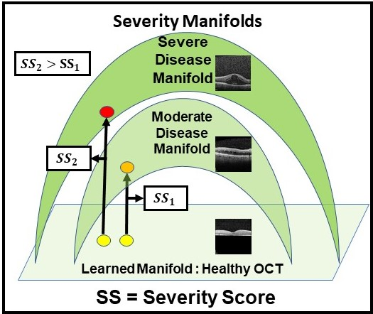

# GRADIENT-BASED SEVERITY LABELING FOR BIOMARKER CLASSIFICATION IN OCT

***

This work was done in the [Omni Lab for Intelligent Visual Engineering and Science (OLIVES) @ Georgia Tech](https://ghassanalregib.info/). 
It has recently been accepted for publication in the IEEE International Conference on Image Processing!!
Feel free to check our lab's [Website](https://ghassanalregib.info/publications) 
and [GitHub](https://github.com/olivesgatech) for other interesting work!!!

***

## Citation

K. Kokilepersaud, M. Prabhushankar, G. AlRegib, S. Trejo Corona, C. Wykoff ”GradientBased Severity Labeling for Biomarker Classification in OCT,” in 2022 IEEE International
Conference on Image Processing (ICIP), Bordeaux, France, 2022.

@inproceedings{kokilepersaud2022severity,
title={Gradient-Based Severity Labeling for Biomarker Classification in OCT},
author={Kokilepersaud, Kiran and Prabhushankar, Mohit and AlRegib, Ghassan and Trejo
Corona, Stephanie and Wykoff, Charles},
booktitle={IEEE International Conference on Image Processing},
year={2022}}

## Abstract
In this paper, we propose a novel selection strategy for contrastive learning for medical images. On natural images,
contrastive learning uses augmentations to select positive
and negative pairs for the contrastive loss. However, in the
medical domain, arbitrary augmentations have the potential
to distort small localized regions that contain the biomarkers
we are interested in detecting. A more intuitive approach
is to select samples with similar disease severity characteristics, since these samples are more likely to have similar
structures related to the progression of a disease. To enable
this, we introduce a method that generates disease severity
labels for unlabeled OCT scans on the basis of gradient responses from an anomaly detection algorithm. These labels
are used to train a supervised contrastive learning setup to
improve biomarker classification accuracy by as much as 6%
above self-supervised baselines for key indicators of Diabetic
Retinopathy.

## Visual Abstract

## Data

The data for this work can be found at this 
[zenodo](https://doi.org/10.5281/zenodo.7105232) location, 
with the associated paper located [here](https://ieeexplore.ieee.org/stamp/stamp.jsp?arnumber=9897215).

Partitions of the data into training and test splits can be found in the directories
final_csvs_1, final_csvs_2, and final_csvs_3. The number indicates which split of patients is currently being used. This paper uses the data in final_csvs_1. However, feel free to try alternate methods.

In a typical experiment, contrastive pre-training takes place on the data present in the file:

**./gradcon_files/prime_trex_gradcon_process_50.csv**

Biomarker fine-tuning typicall takes place in the file:

**./final_csvs_1/biomarker_csv_files/complete_biomarker_training.csv**

Testing files are located in the folder:

**./final_csvs_1/test_biomarker_sets**

## Acquiring the GradCon CSV Files

1. Acquire the OCT NORMAL data from the [Kermany dataset](https://www.kaggle.com/datasets/paultimothymooney/kermany2018).

2. Train the auto-encoder network to learn in distribution OCT data using the [GradCon method](https://github.com/olivesgatech/gradcon-anomaly). Train for 1000 epochs or until the loss converges.

3. Pass in the unlabeled training data from the OLIVES dataset into the trained auto encoder. This unlabeled data csv file can be found at **./final_csvs_1/Datasets_Conjoined/prime_trex_compressed.csv**

4. Collect the GradCon score for every sample.

5. Discretize the scores into a defined number of bins. The csv files we use are located at:  **./gradcon_files/prime_trex_gradcon_process_50.csv**. The "50" represents the number of bins that the  gradcon scores are discretized into. 

## Code Usage

1. Set the python path with: **export PYTHONPATH=$PYTHONPATH:$PWD**

2. Train the backbone network with the supervised contrastive loss using the parameters specified in config/config_supcon.py \
a) Specify number of gradcon labels to train with --num_methods parameter \
b) Specify which gradcon labels to train with --method1, --method2, etc. \
c) Specify which dataset to train within in the --dataset field \
d) An example of a script would be: \
python training_main/clinical_sup_contrast.py --dataset 'Prime_TREX_DME_Fixed' --num_methods 1 --method1 'gradcon_1000'

3. Train the appended linear using the parameters specified in config/config_linear.py \
a) Set the super flag to identify whether to use contrastively trained backbone (0), completely supervised (1), or fusion supervised (2). \
b) Set the multi flag to (1) in order to control whether multi-label classification is used and (0) otherwise. \
c) If not using multi-label classification, then set the biomarker flag to the biomarker of interest used in this study. \
d) Set the --dataset field. \
e) An example of this script would be: 
python training_main/main_linear.py --dataset 'Prime' --multi 0 --super 0 --ckpt 'path_to_checkpoint file' --biomarker 'fluid_irf'

### Acknowledgements

This work was done in collaboration with the [Retina Consultants of Texas](https://www.retinaconsultantstexas.com/).

This codebase utilized was partly constructed with code from the [Supervised Contrastive Learning](https://github.com/HobbitLong/SupContrast) Github.